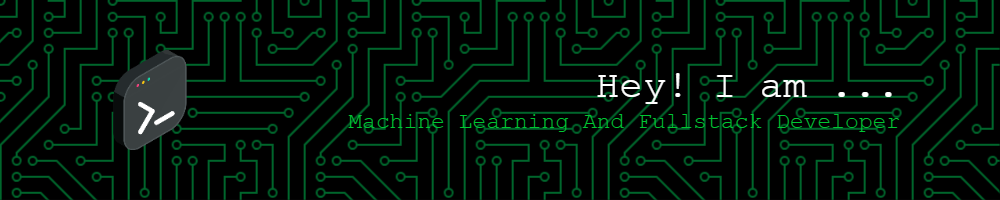

<!-- Banner Image -->

<!-- Introduction -->
# Hi there, I'm Subramanian Iyer! 👋

I'm a passionate **Machine Learning** and **Full Stack Developer** who loves to code and create amazing things. Welcome to my GitHub profile, where I showcase my projects, share knowledge, and connect with fellow developers.

<!-- Technologies -->
## Technologies I Love ❤️

- **Languages:** Python, JavaScript
- **Web Development:** Node.js, React.js
- **Machine Learning:** TensorFlow, scikit-learn
- **Databases:** MongoDB, PostgreSQL

<!-- About Me -->
## About Me

I thrive on building innovative solutions by combining the power of **Machine Learning** and the creativity of **Full Stack Development**. My journey in tech has been filled with exciting challenges, continuous learning, and the joy of solving real-world problems.

<!-- Connect with Me -->
## Let's Connect 🌐

You can connect with me on LinkedIn or reach out via email:

- 
- **Email:** [iyersubramanian101@gmail.com](mailto:iyersubramanian101@gmail.com)

Feel free to drop me a message if you have questions, project ideas, or just want to chat about tech and development.

<!-- Visitor Badge -->

Thanks for stopping by! 😄
